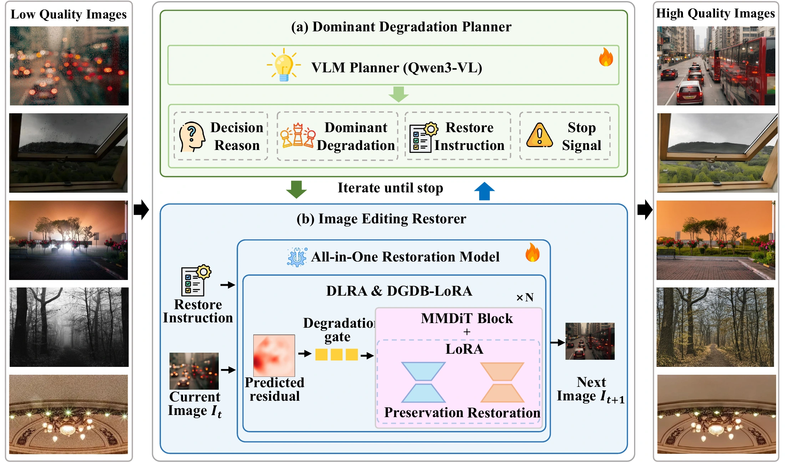
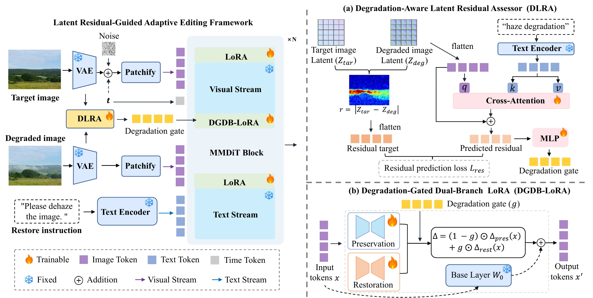

# DDPR: Dominant Degradation Planning with Latent Residual-Guided Adaptive Editing for All-in-One Image Restoration

[**Project Page**](https://wangq6588-a11y.github.io/DDPR/)

Qi Wang, Xian Hu, Hainuo Wang, Wei Deng*, Chengli Peng*

* Corresponding authors.

## Method

