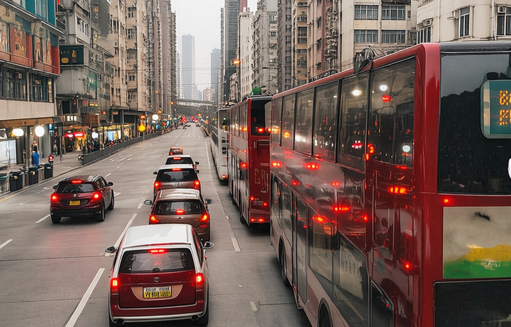
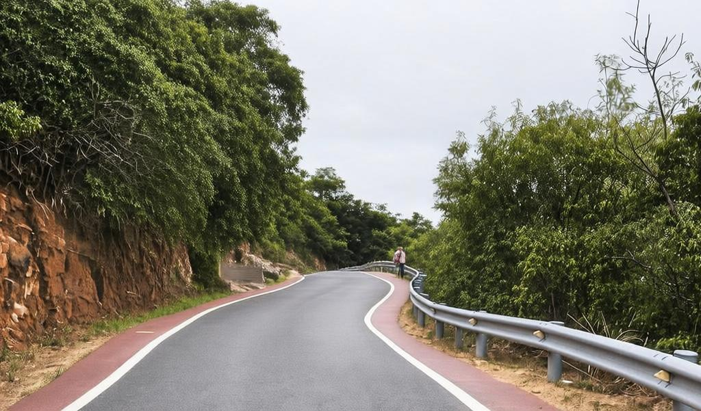
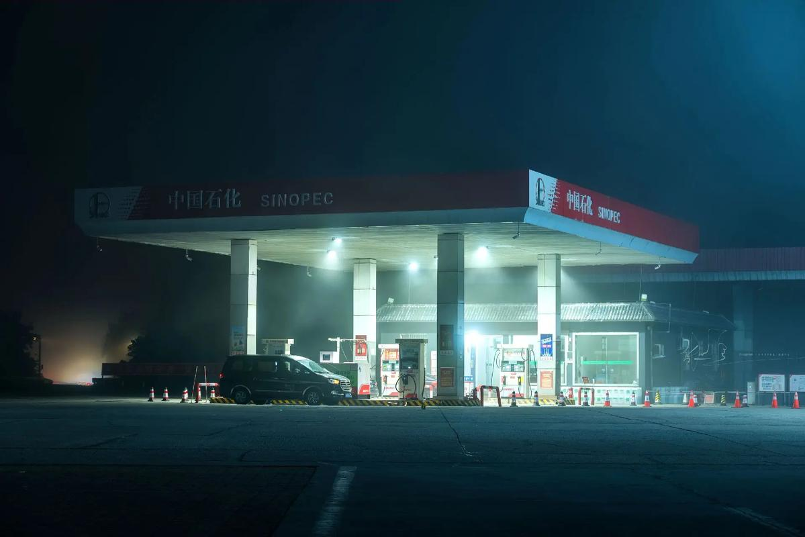
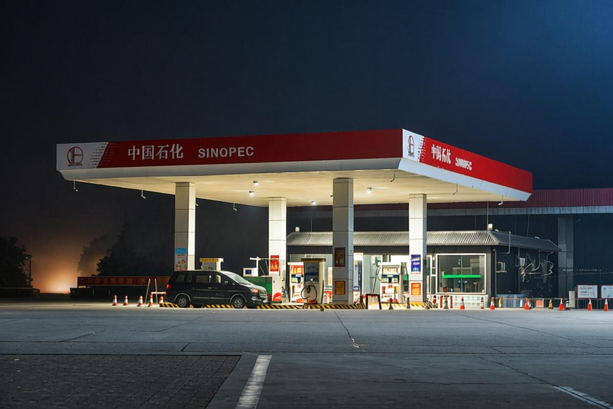
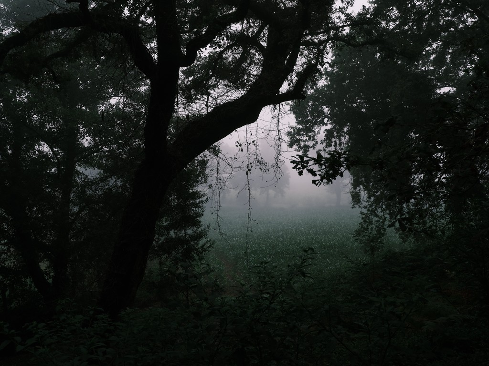
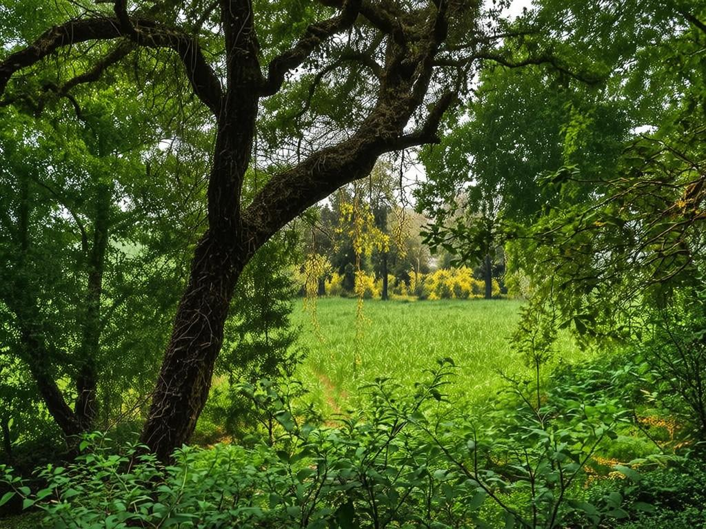

# DDPR: Dominant Degradation Planning with Latent Residual-Guided Adaptive Editing for All-in-One Image Restoration

## Method

## Visual Results

| Input | DDPR |
| --- | --- |
|  |  |
|  |  |
|  |  |
|  |  |
